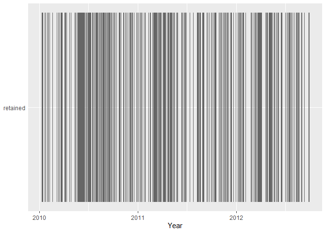

<!-- README.md is generated from README.Rmd. Please edit that file -->

# nphawkes

<!-- badges: start -->

<!-- badges: end -->

The nphawkes package can be used to study Hawkes processes using
nonparametric procedures. Data may be applied to the Model Independent
Stochastic Declustering (MISD) algorithm to probabilistically classify
events as background or triggered events. The conditional intensity of
the process can be calculated, and residual analysis may be exectued via
thinning, superpositioning, or super-thinning. This package may also be
used to create plots such as histogram estimators of the triggering
functions, line plots of the conditional intensity, and histograms of
the residual process. Temporal and spatio-temporal Hawkes processes can
be used, along with marked versions of each.

## Installation

<!-- You can install the released version of nphawkes from [CRAN](https://CRAN.R-project.org) with: -->

You can install the resleased version of nphawkes from
[GitHub](https://github.com/) with:

``` r
# install.packages("devtools")
devtools::install_github("boydpe/nphawkes")
```

## Example

We will demonstrate the use of the package with simulated earthquake
data available within the package.

``` r
library(nphawkes)
load(file = "data/quake.RData")
head(quake)
#>         lon         lat         t        m     time       date
#> 1 0.6944789 0.698142489  8.966234 3.756671 23:11:23 2010-01-09
#> 2 0.6834387 0.686690810 10.223219 3.569237  5:21:26 2010-01-11
#> 3 0.7150710 0.674706658 12.579882 3.038466  13:55:2 2010-01-13
#> 4 0.9108068 0.629251374 19.361115 3.672588   8:40:0 2010-01-20
#> 5 0.4389249 0.002338193 23.427427 3.047991 10:15:30 2010-01-24
#> 6 0.3801922 0.120843447 29.829610 3.042964 19:54:38 2010-01-30
```

We will first employ the MISD algorithm to decluster the earthquake
catalog using time and marks (magnitude). The temporal bins
(time\_breaks) will be defined, in terms of days, and we will use
roughly uniform bins for marks by setting the `mark_quantile` inputs
equal to `TRUE`. We’ll set out reference date to be January 1, 2010, the
date that our simulated catalog began.

``` r
out = nph(dates = quake$date, ref_date = "2010-01-01",
          marks = quake$m, 
          time_breaks = c(0, 2, 5, 10, 31, 1500),
          time_quantile = FALSE,
          mark_quantile = TRUE,
          time_of_day = quake$time)
```

We can view the background rate and percentage of mass that lies on the
diagonal of the resulting probability matrix.

``` r
out$br
#> [1] 0.2273166
out$perc_diag
#> [1] 0.4835902
```

We can then inspect histogram estimators of the triggering functions.
The triggering plots include standard error estimates, which can be
separately calculated using `se_bars(model)`.

``` r
trig_plots(model = out, g_max = 32,
           k_max = 4, k_min = 3)
```


    #> TableGrob (1 x 2) "arrange": 2 grobs
    #>   z     cells    name           grob
    #> 1 1 (1-1,1-1) arrange gtable[layout]
    #> 2 2 (1-1,2-2) arrange gtable[layout]

We’ll now calculate the conditional intensity of the process.

``` r
ci = cond_int(model = out)
head(ci)
#>       times lat lon    marks  cond_int       Date
#> 1  8.966238   0   0 3.756671 0.2300374 2010-01-09
#> 2 10.223218   0   0 3.569237 0.7084398 2010-01-11
#> 3 12.579884   0   0 3.038466 0.3536702 2010-01-13
#> 4 19.361111   0   0 3.672588 0.2528203 2010-01-20
#> 5 23.427431   0   0 3.047991 0.3293583 2010-01-24
#> 6 29.829606   0   0 3.042964 0.2853797 2010-01-30
```

We can perfrom super-thinning as a residual method, thinning events in
areas of high conditional intenstiy and superpositioning events in areas
of low intensity. We’ll use the median value of the conditional
intensity as the threshhold value.
<!-- We'll use the `sim_grid = TRUE` argument since the geographical coordinates are simulated within the $`[0\times1]\times[0\times1]`$ grid.  -->

``` r
st = super_thin(K = "median_ci", model = out,
                method = "superthin")
head(st)
#>          times lat lon    marks  cond_int       Date         p keep   type
#> 1     8.966238   0   0 3.756671 0.2300374 2010-01-09 1.0000000    1 retain
#> 2    10.223218   0   0 3.569237 0.7084398 2010-01-11 0.6534822    1 retain
#> 3    12.579884   0   0 3.038466 0.3536702 2010-01-13 1.0000000    1 retain
#> 1100 17.845554   1   0 3.000474 0.2404118 2010-01-18 0.4806991    1    sim
#> 4    19.361111   0   0 3.672588 0.2528203 2010-01-20 1.0000000    1 retain
#> 5    23.427431   0   0 3.047991 0.3293583 2010-01-24 1.0000000    1 retain
```

After super-thinning, we can view a histogram of the residual process to
assess the resulting distribution.

``` r
ci_hist(st)
```


We can view the conditional intensity of the process, plotted against
the frequency of events. The conditional intensity is

``` r
ci_plot(model = out, superthin = st)
#> Joining, by = "Date"
```


Finally, we can inspect a plot that shows where events are superposed
and where events are thinned. This tiered plot shows, over time, events
that were not thinned (retained), superposed events, and thinned events.

``` r
st_plot(st)
```


